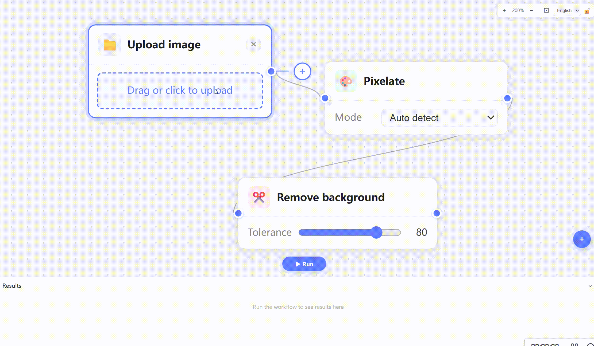

# imgtopixel

Language docs:
- English (this file)
- [中文文档](docs/README.zh-CN.md)
- [日本語ドキュメント](docs/README.ja.md)

A browser-based node workflow tool to normalize AI-generated pixel-art assets: remove background, detect pixel blocks, and pixelate/resample to a target grid for cleaner editing and reuse. It is suitable for AI pixel-art assets and AI assets prepared for game-engine cutout/sliced animation workflows.

## Demo



## Why This Project Exists

In production, AI-generated "pixel style" images usually have practical issues:

- Pixel blocks are not truly aligned or consistent.
- Asset sizes are inconsistent in one batch (hard to standardize to 32x32 / 64x64, etc.).
- Some AI tools require a minimum upload size (for example, 512x512).

## Goals

imgtopixel focuses on turning "pixel-like" images into assets that are easier to edit and manage:

- Remove backgrounds quickly.
- Infer real block size and grid offset.
- Normalize to a target pixel grid size.
- Process multiple images and export PNG outputs.

## Current Scope

Workflow nodes:
- `Upload`
- `RemoveBg` (local, edge-color + BFS flood)
- `AiRemoveBg` (powered by `@imgly/background-removal`)
- `Pixelate` (`Auto`, `Manual Size`, `Manual Target`)

Runtime behavior:
- Result panel previews outputs from terminal nodes and supports per-image download.

## Quick Start

```bash
npm install
npm run dev
```

```bash
npm run lint
npm run build
```

## Typical Workflows

- `Upload -> Pixelate(Auto)` for block-size cleanup.
- `Upload -> RemoveBg -> Pixelate(Manual Target 64x64)` for transparent normalized assets.
- `Upload -> AiRemoveBg -> Pixelate(...)` for harder background cases.

## CI and GitHub Pages

- CI runs on `push main` and `pull_request` (`lint + build`).
- GitHub Pages deploy runs on `push main`.
- In repo settings, set `Settings -> Pages -> Build and deployment -> Source` to `GitHub Actions`.

## Suggested Asset Folders

- Developer test sample images: [`tests/samples/`](tests/samples/README.md)
